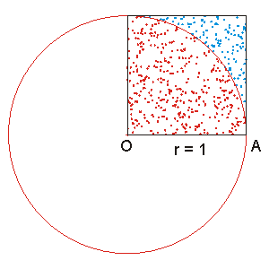

### Generates π using Monte Carlo methods.

Let X be a [0,1]x[0,1]. The surface area of X is equal to 1. Let S be an area bounded by curve
    given by equation y=sqrt(1-x2).


The surface area of S is equal to π/4.
The ratio of surface areas is π/4. So if we randomly generate points from square [0,1]x[0,1],
fraction of points in S should be equal to π/4.
  
By using the Monte Carlo method, write a function

```
    public static double ApproximationOfPi(int n) {
        // TODO Create function
    }
```

which take argument n which is a number of points using to approximates the value of π . Use the analysis above. 
<div class="hint">
  A class that should be useful is java.util.Random.
</div>


